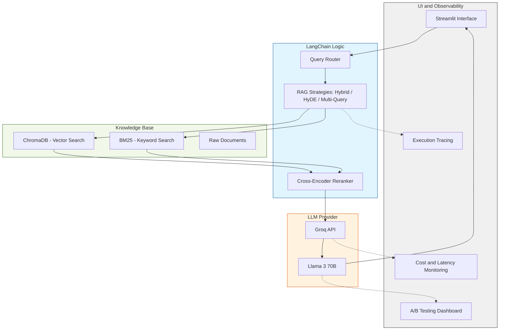

# RAGScope Pro: Insight & Observability Platform


-blueviolet?style=for-the-badge)


**RAGScope Pro** is an enterprise-grade visualization and experimentation workbench for **Retrieval-Augmented Generation (RAG)** systems.

Designed for AI Engineers and Data Scientists, this platform moves beyond simple "chat with PDF" tutorials. (HarryPotter) It provides a rigorous environment to **benchmark, visualize, and debug** complex retrieval strategies—including Hybrid Search, Reranking, and HyDE—using real-time execution logs and cost analysis.


---

## Key Features

### Advanced RAG Strategies
Implements **8 production-ready patterns** to handle complex queries:
- **Hybrid Search:** Weighted ensemble of BM25 (Keyword) and Vector Search (Semantic).
- **Reranking:** Second-pass relevance scoring using Cross-Encoder logic.
- **HyDE (Hypothetical Document Embeddings):** Generates hallucinated answers to bridge the semantic gap.
- **Multi-Query & Sub-Query:** Query expansion and decomposition for complex reasoning.
- **Parent-Document Retrieval:** Returns full context from small, precise index chunks.

### Observability & Analytics
- **A/B Testing Dashboard:** Compare two different RAG pipelines side-by-side (e.g., *Vector Only* vs. *Hybrid + Rerank*).
- **Execution Tracing:** Real-time logging of every step (Query Rewriting -> Retrieval -> Scoring -> Generation).
- **Cost & Latency Monitoring:** Live calculation of token usage and processing time per query.

### Interactive Learning Module
- **CS101-Style Visuals:** Built-in educational module with Graphviz flowcharts explaining "How It Works" for each technique.

---

## Tech Stack

| Component | Technology | Description |
| :--- | :--- | :--- |
| **Frontend** | Streamlit | Reactive web interface with custom CSS styling. |
| **LLM Inference** | Groq API | Ultra-low latency inference for **Llama 3 (70B)**. |
| **Orchestration** | LangChain | Chain management and prompt engineering. |
| **Vector DB** | ChromaDB | Local, persistent vector storage for embeddings. |
| **Embeddings** | HuggingFace | `all-MiniLM-L6-v2` for efficient semantic encoding. |
| **Keyword Search** | BM25 | Sparse retrieval for exact match capabilities. |
| **Visualization** | Graphviz | Automated flowchart generation for system architecture. |

---

## Project Structure

```bash
ragscope-pro/
├── data/                   # Raw knowledge base (.txt files)
├── processed_data/         # Persisted Vector Database (ChromaDB)
├── src/
│   ├── modules/            # Core Business Logic
│   │   ├── config.py       # Global settings & presets
│   │   ├── database.py     # Vector DB & File I/O operations
│   │   ├── llm.py          # LLM Provider initialization
│   │   ├── rag_pipeline.py # RAG Algorithms & Logic
│   │   ├── languages.py    # Localization (EN/TH)
│   │   ├── ui.py           # UI Components & CSS
│   │   └── visuals.py      # Graphviz Flowchart Rendering
│   ├── app.py              # Main Application Entry Point
│   └── ingest.py           # Data Processing Script
├── requirements.txt        # Dependency list
└── README.md               # Documentation
```

### Installation & Setup
### 1. Prerequisites
Ensure you have Python 3.9+ and Graphviz installed on your system (required for flowcharts).

```bash
# MacOS
brew install graphviz

# Windows
winget install graphviz
```

### 2. Clone Repository

```bash
git clone https://github.com/sitta07/RAGScope.git
cd ragscope-pro
```

### 3. Virtual Environment

```bash
python -m venv venv
source venv/bin/activate  # Windows: venv\Scripts\activate
pip install --upgrade pip
```

### 4. Install Dependencies

```bash
pip install -r requirements.txt
```

### 5. Ingest Data (Build the Brain)
Place your .txt files in the data/ folder (default includes Harry Potter lore), then run:

```bash

python src/ingest.py
```

This will generate the processed_data/ directory containing the Vector Index.


### Usage
Run the application:
```bash
streamlit run src/app.py
```
---

### You can try and test the application directly on the web:

👉 https://ragscope-pro.streamlit.app/

**Feel free to explore the features, interact with the interface, and evaluate the system performance in real time.**

### Configuration (Bring Your Own Key)
This application uses Groq API for high-speed inference.

### Get a free API Key at:
👉 https://console.groq.com./home

Enter the key in the Welcome Screen when the app launches.
(Optional) For deployment, set groq_api_key in Streamlit Secrets.

## 👨‍💻 Author

**Sitta Boonkaew**  
AI Engineer Intern @ AI SmartTech  

---

## 📄 License

© 2025 Sitta Boonkaew. All rights reserved.

This project is a personal project .

